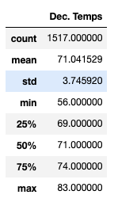

# **Surfs Up**
### Module 9 - Climate_Analysis
## Overview of the Analysis ##
The purpose of this analysis is to provide W.Avy with insight into whether the proposed surf and ice cream shop will be a sustainable, year-round venture. We are assessing the temperatures for the entire month of June and December using sqlite, jupyter notebook and pandas to analyse the data provide by the Hawaii sqlite file.

## Results
</img>
</img>

I have attached the results of the analysis above.  Three major points are as follows:
1.  From these queries we can ascertain that the mean and median temperatures are very close, suggesting that we have a non-skewed sampling of data for both months.  
2. While the minimum temperature in December reaches a low of 56 degrees, the mean temperature is 71 degrees, only approximately 4 degrees lower than in June, which suggests good surfing/ice cream eating weather in both seasons.
3. Examining the sample size of each data set, we can infer that there are at about 56 datapoints (being both different year data and different station data) for each day in June and 48 datapoints for each day in December. Assuming no differences in climate patterns we can assume that this is a large enough data set to be able to trust the data.

## Summary

Likely because Hawaii is close to the equator, there are not significant differences in the mean temperature in June and December, thus appearing to make it a solid investment for W. Avy. However, there are some other key points that I would recommend investigating before they make a final decision.

1. Firstly, I would recommend a query that combines and reveals data regarding temperatures in both months with precipitation. Because Hawaii is close to the equator, it would be wise to find out how rainy seasons affect weathers (and surfing conditions) It is beyond the scope of our data set but it would also be worthwhile to investigate wind conditions for the island.
YoY trends
2. I would also recommend adjusting out data to investigate yearly trends for weather throughout June and December to see if there are any concerns that arise
when examining data year over year. 
